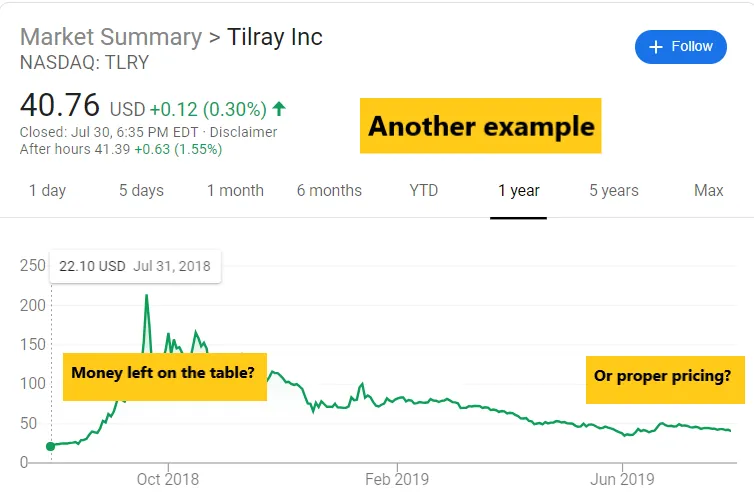

## What goes on behind the scenes of an IPO?

People hear about IPOs frequently, but usually are less aware of what happens behind the scenes. a16z recently [wrote a post](https://a16z.com/2019/07/09/ipo-process-prices-behind-scenes-companies/ 'a16z') about the process, and I'm following up with some of my experience. As a reminder, none of this is investment advice. Ever.

> \[The S1\] also serves as a marketing document positioning the company and its role in the marketplace, because the company has to avoid public promotion during the waiting period and follow strict rules around what they can and can’t say on behalf of the company. But behind closed doors during this time, the company does pre-pitch the company story and financials to potential investors.

The "dumb" retail investor buys into an IPO because they've heard the stock will do well. The "smart" retail investor does diligence on the S1, comes up with their own financial model, and then decides whether they should participate.

Most retail investors assume there's a level playing field, since the S1 should show all the important publicly available information and there shouldn't be anything they're missing out. **This has never been true.** Professional investors meet with management _all the time_, even pre-IPO. They don't get material non-public information from these meetings, but I can assure you that nobody would waste their time doing management meetings if they weren't helpful in some way.

> With the order book in hand, the underwriters (banks) will allocate the shares to institutional investors. As part of this, they — and the company — want to minimize IPO allocations to investors that have a track record of selling the stock too quickly. They don’t always succeed in doing this, but that’s OK, since some selling helps make a “market”.

There's a capital markets team in the investment bank that works together with the company to decide how much stock to initially give out to the interested investors. Investors could ask for 10 shares at a $40 IPO price, but just 5 shares if the IPO price goes up to $45. Investors frequently ask for more shares than they think they'll get, leading to an offering being "oversubscribed". **Nearly all offerings are oversubscribed,** so if you read the news reporting that, just ignore it.

The intent during this bookbuilding process is to determine what price the company should IPO at, how much "real" demand there is, and who to give it to. I think regular IPOs usually allocate ~80% to institutional clients and ~20% other (**Winnie**, correct me if I'm mistaken here). Importantly, you and I don't get to buy at the IPO price, but only at the price the stock starts trading at, which is usually higher.

> People often assume an IPO means the entire company is going public — just because those companies are required to open their books and report their earnings on a quarterly basis — but actually no more than 10%-15% of the company is typically being sold. Such limited supply can have outsize impact in a short time frame, especially if there’s great demand.

No company I know of has given 100% of the company away during an IPO. I suppose it's possible, but that would be strange and probably a red flag. The price is [usually set to have a first day "pop"](https://clutejournals.com/index.php/JBER/article/view/2412 'IPO pop') as a form of reward to the shareholders that supported the company and to also generate positive publicity and good vibes for the company employees.

[Critics of the IPO process](https://markets.businessinsider.com/news/stocks/slacks-direct-listing-bill-gurley-says-startups-call-morgan-stanley-2019-6-1028298641 'Bill') think that this "pop" leaves money on the table, which is true, but **most employees would (irrationally) prefer to have the stock IPO and keep going up** rather than the reverse.

> So how to gauge the success of IPO after the “pop”? Beyond Meat is trading today above $100. Does that mean the company left money on the table? If you do the math, the company raised about $240 million from the IPO. Had the stock been priced at the first-trade price ($46), however, it could have raised nearly double that amount — and well more if it had priced at the closing stock price. Then again, people might not have invested as much at that price.

To further explain the ["money on the table" issue](http://www.underpricing.de/Downloads/Louhgran_Why%20Dont%20Issuers.pdf 'research'), BYND priced at $25, meaning institutional investors (not you and I) bought it at $25. When it started trading, someone (could be you or I now) put in an order at $46, and a holder of the share was willing to sell at $46, hence filling that order.

Some people would argue that if there was demand at $46, perhaps BYND should just have priced at $46 instead and gotten more cash from investors. Bill Gurley would argue to use a direct listing instead to match all demand and supply.

I agree there's money left on the table, but think about the alternative. Suppose BYND priced at $100 right from the start. That leaves nothing on the table, but now there's a much higher chance the price declines after the IPO. And if it does decline, perhaps the price momentum keeps sinking it lower. We don't know how much of the current trading price of BYND is due to momentum, and it seems to me it could have gone the other way as well. The general public still thinks of FB, GOOG, and Uber's IPOs as failures due to the lack of a "pop". You might argue who cares about the general public, but employee morale within the company is affected as well. **My point here is there's currently less incentive for companies to get pricing exactly right, and who knows what the right price is anyway?**
