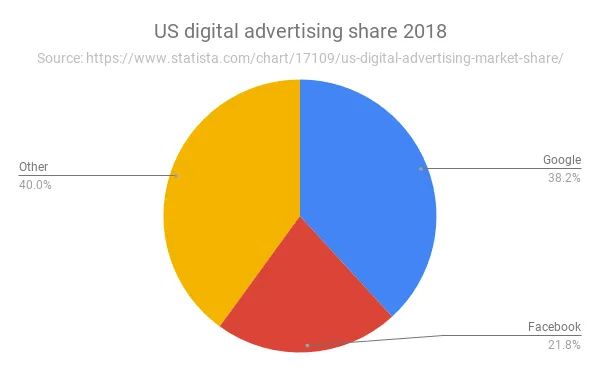

## Why are newsletters becoming popular and where is this trend going?

After I published last month's newsletter, [a16z led a $15mm funding round in Substack](https://on.substack.com/p/the-future-of-substack 'substack site'), the platform I'm currently using to send this [^6]. I'm going to talk about why a16z was interested in Substack and where I think this trend is headed.

From [a16z's press release](https://a16z.com/2019/07/16/substack/ 'a16z'):

> Since then, the internet has opened up new opportunities for media producers. A writer, streamer, or podcaster can now reach an audience of millions. Powerful tools have been created to make it easier to self-publish any format of content. \[...\] But most of this is driven by advertising-based business models from the 1800s — the technology may have changed, yet the economic model is largely the same.

Stratechery has [written before](https://stratechery.com/2015/why-web-pages-suck/ 'ads') on how ad networks facilitated the growth of advertising on the internet. The move from print media to digital media implied that the marginal cost to serve a consumer was zero. This reduction of the barrier to entry led to an influx of free content online, a trend which has still persisted but evolved into different forms [^1].

**Because of the low cost to produce, high degree of substitutability, and high degree of fragmentation in the suppliers of content, content producers assumed that [people wouldn't pay for content](https://www.cnbc.com/2018/11/17/subscription-news-services-flourish-as-google-facebook-dominate-ads.html 'cnbc'), and that selling ads was the better business model.**

As [the CNBC article](https://www.cnbc.com/2018/11/17/subscription-news-services-flourish-as-google-facebook-dominate-ads.html 'cnbc') notes though, a few factors have led to the rise of alternative, subscription based models instead. **The dominance and effectiveness of google and facebook in digital advertising means that advertising on traditional content producers such as news sites has become less effective.** As an advertiser, I'd rather spend more of my ad budget on where 60% of the internet is going to pass through and get a higher ROI on my ad spend.

The stranglehold on traffic by Google and Facebook also potentially result in a cost to acquire the marginal user, implying that the marginal cost to serve is no longer zero. For the normal media site, you're now facing a scenario in which you have declining organic traffic and a reduced relationship with your customer, but still face the problems of a glut of free content by your competition that makes it hard for you to differentiate.

As a result, we've seen most content producers reliant on ads suffer, even as the overall digital market continued growing. In response, some pivoted towards subscriptions, such as the niche tech news site [The Information](https://digiday.com/podcast/the-informations-jessica-lessin-on-five-years-of-subscription-journalism/ 'Info'). The WSJ, Washington Post, NYT etc have all bought into this trend [^2], hoping that their quality content will be enough to convince people to pay. Some might say [their supposed success](https://digiday.com/podcast/inside-wall-street-journals-subscription-strategy/ 'WSJ') show that subscriptions are the way to monetize moving forward. **I agree that subscriptions will continue growing, but am more uncertain about how scalable they can be.**

> today, a direct relationship between creators and audiences can unlock a new generation of professional writers and content creators. That’s where Substack — which is building the leading subscription platform for independent writers to publish newsletters, podcasts, and more — comes in.

The key to monetization is having that **direct relationship to your audience.** If you outsource that to Google or Facebook, you're choosing to be intermediated. The newsletter trend is interesting precisely because there's no chance of being intermediated, short of email providers starting to charge for the service [^3]. As a writer, it feels more intimate compared to publishing publicly on a website, linkedin, or medium. You feel better since your readers have opted in to the service, which implies that people actually want to read your ramblings [^4]

> Most importantly, Substack handles all of the tech powering a subscription-based platform for writers to engage with — and grow — their audiences.

[I've written before](https://leonlins.com/writing/2019_05_19_substack/ 'substack') about why I ended up choosing Substack. I've been ~~spamming~~ emailing friends random thoughts for years now, and they occasionally were kind enough to reply letting me know I wasn't just writing into a bleak empty void of nothingness. However, as the email list grew, I needed a more scalable and professional looking solution. A newsletter service allowed me an easier way to manage email signups, easier way for people to unsubscribe [^5], and an overall better looking experience on web and mobile. It isn't perfect, and I have a bunch of suggestions, but I've liked the move so far.

Where does this trend go? [Substack grew from 11k paying subscribers in 2018 to 50k paying subs now](https://www.vanityfair.com/style/2019/07/peak-personal-newsletter-and-i-feel-fine-substack-tinyletter 'peak?'), and the number of newsletters I'm subscribed to has grown over the years too [^6]. I'm 80% certain we haven't hit peak newsletter yet, and Substack can double its paying subs. With [millions of people still paying for dial-up internet](https://www.digitaltrends.com/cool-tech/aol-dial-up-a-relic-of-the-past/ 'aol'), I'm confident that the market size of people willing to pay for content on a niche topic can continue growing.

I do think the content has to be [focused on a niche](https://on.substack.com/p/the-future-of-substack 'substack success niche') though, similar to how people expect Matt Levine or Morgan Housel to write about finance and would unsubscribe if the content changed topics. Only a few mainstream publications such as the WSJ are able to charge a paywall, so we might see a combination of 1) large mainstream publications having to do ads and 2) niche quality publications doing subscriptions.

People want to read good analysis on issues they care about, and a small subset of that would be willing to pay to support the creators. [Looking at the average Patreon earnings](https://www.crowdcrux.com/patreon-statistics-and-demographics-average-patreon-earnings/ 'Patreon'), the average payment is in the small ~$10 monthly range. I think average payments don't grow significantly, but the amount of paying users will. ARPU flat and DAUs accelerating, if you want to put a financial model together.

In the meantime, I'm treating all of this as an experiment to see how much I like writing. Given the potentially [high upside and relatively low downside, I agree with others](https://www.perell.com/blog/why-you-should-write 'write') that it's worth trying to write and publish your thoughts. Writing has helped me better understand concepts, connected me with interesting people, and given me something to procrastinate on instead of doing work. I hope to continue doing so for quite some time. As always, feedback welcome!

[^1]: I'd like to take credit for Substack and Cameo both raising up rounds after I wrote about them, but somehow doubt that I'm actually that influential.

[^2]: For example the blogging wave to the facebook wave to the instagram wave to the tik tok wave. People feel empowered to create and publish their own content for (hopefully) the world to see, in a bid for fame or status.

[^3]: In various ways, such as a freemium model, limited paywall, hard paywall etc

[^4]: Unlikely, but given [Superhuman's](https://a16z.com/2019/06/27/superhuman/ 'a16z') popularity, there's a non-zero chance?

[^5]: Whether out of sheer pity or genuine interest is a separate matter

[^6]: I used to mention this more often, but I really don't mind if you unsubscribe if you're not interested! I don't like spamming people

[^7]: Some newsletters I'm subscribed to are [Movements for micromobility](https://movements.substack.com/ 'movements'), [The Profile](https://theprofile.substack.com/ 'profile') for long-form people stories, and [The Diff](https://medium.com/@byrnehobart/about-best-of-faq-25df97a74467 'Diff') for interesting non-consensus takes
