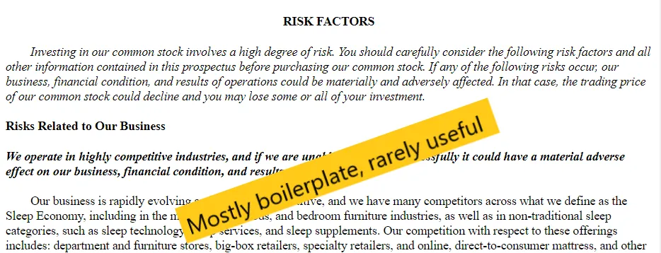
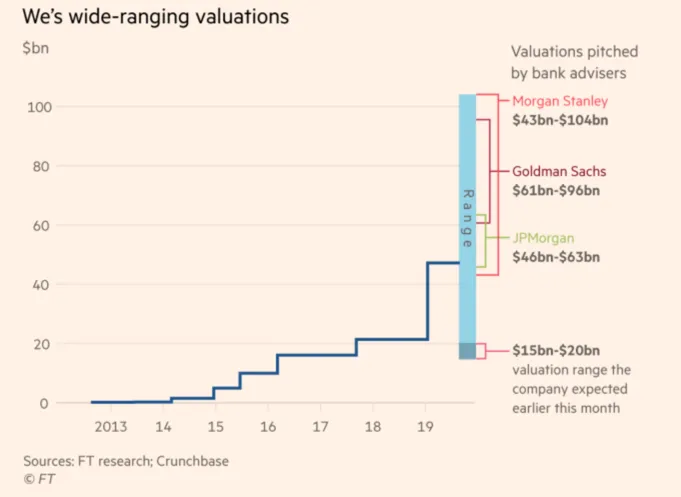
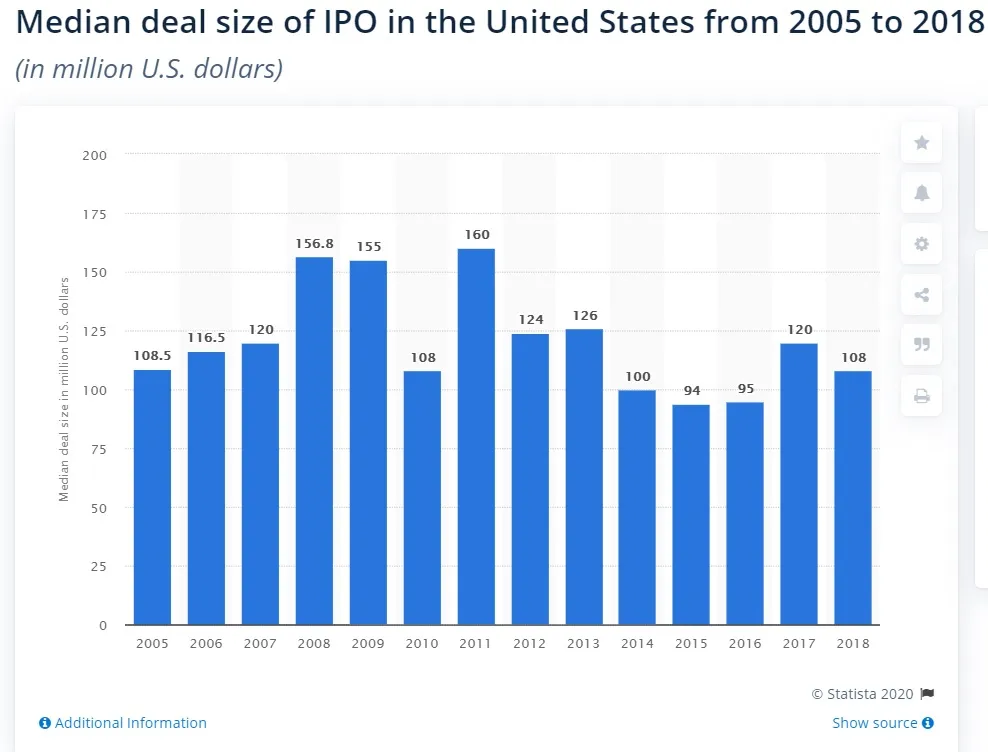
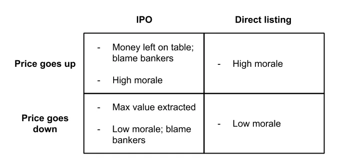

## Takeaways

Whether you should do a direct listing depends on the type of company you are

## IPOs vs direct listings

[Aswath Damodaran](https://twitter.com/AswathDamodaran?ref_src=twsrc%5Egoogle%7Ctwcamp%5Eserp%7Ctwgr%5Eauthor 'Aswath'), one of the best finance profs out there [^1], [wrote about IPOs vs direct listings a while ago](http://aswathdamodaran.blogspot.com/2019/10/disrupting-ipo-process-challenging.html? 'Aswath'). I'll review highlights below; banking ex-colleagues feel free to disagree. If you aren't familiar with direct listings, [a16z has a primer.](https://a16z.com/2019/07/02/direct-listings/ 'a16z')

> but the biggest difference \[in direct listings\] is that it cannot raise fresh capital on the offering date \[...\] That is not as much of a problem as it sounds, since the company can choose to raise cash in a pre-listing round from interested investors, or to make a secondary offering, in the months after

The inability to raise new capital remains true for now, [after the SEC rejected a proposal to allow it](https://www.cnbc.com/2019/12/06/nyse-proposal-to-allow-fundraising-in-direct-listings-rejected-by-sec.html 'CNBC'). As Aswath points out, this isn't a dealbreaker since companies can raise before or after the listing instead.

Aswath describes the case for and against banks managing an IPO vs listing directly with less bank involvement [^2]:

> **Timing:** Banks argue their experience and relationships give them insight on the best time to IPO

> Damodaran argues that no one can really time the market, as seen when momentum abruptly shifts, such as in late 2019

I lean more towards Damodaran's side here. In the bank's defense, in their role as middlemen talking to investors, they do get regular feedback on how investors are feeling. You can't say for certain until you try to actually price your stock though.

> **Prospectus expertise:** Banks argue their experience can help guide the drafting of the filing documents

> Damodaran argues that most prospectuses look similar, particularly the risk and business sections.

I agree with Damodaran, though as he implied most of this is due to legal reasons. Risk sections in prospectuses are more for legal protection and less for telling you what's important [^3]. I know ex-colleagues that spent a lot of time drafting sections for the company, but **it's hard to add significant value here** (sorry guys), especially if the company going public is full of ex-bankers as well.

> **Pricing of the IPO:** Banks argue they can help bridge the gap between the last private round and the intended public price, find the right comparable company set, choose the appropriate valuation multiples, and identify investor concerns.

> Damodaran argues that banks do a bad job at pricing, as seen in the WeWork IPO. This is because they're choosing the wrong comps or multiples, talking to the wrong investors, or biased in the pricing process, with the last being most likely.

Choosing the wrong comparable company set or multiple is less of a factor. The comp set is socialised among investors beforehand so there's usually broad agreement there [^4]. There's only a handful of common multiples (EV/Rev, EV/EBITDA, P/E) so the type of multiple is also broadly understood.

I agree that banks are biased in the pricing process though, and they are incentivised to be. As [Matt Levine has written before](https://www.bloomberg.com/opinion/articles/2019-09-09/we-might-not-be-working 'Matt'), the bank is pitching to get hired by the company, hence the higher the price range pitched the better. **It's easier to get hired when you tell the CEO he's worth $1bn instead of $100mm.** When they do get hired and need to meet that price is when they start managing expectations.

The right price for the company is a difficult question, and we'll come back to that later.

> **Marketing:** Banks argue that they can reach out to their investor clientele and expand the investor base for an issuing company

> Damodaran argues that a) some companies are now better known than the banks themselves, and b) investors are more skeptical of bank pitches now

The first is subjective; Slack and Spotify can market themselves, [SiTime likely can't](https://www.globenewswire.com/news-release/2019/11/21/1950494/0/en/SiTime-Corporation-Announces-Pricing-of-Initial-Public-Offering.html 'SiTime'). If you're less well-known, having a bank to market you is probably a good idea. The banks will have connections with investors, you won't.

Keeping in mind that [the median IPO offering size is ~$100mm](https://www.statista.com/statistics/251149/median-deal-size-of-ipos-in-the-united-states/ 'Statista'), and that [IPOs sell ~20% of the company](https://corpgov.law.harvard.edu/2017/05/25/2017-ipo-report/ 'Harvard'), we can infer that most IPOs are not the large household names you're already aware of. You can browse [the list of recent IPOs](https://www.nyse.com/ipo-center/recent-ipo 'NYSE') and see how many you recognise. **Most companies probably benefit from having a bank market them and reach out to investors.**

The second point seems irrelevant. If you're a professional investor (buyside) you're not making a decision based on equity research (sellside) recommendations anyway (sorry sellside friends). If you're a retail investor you don't get that info.

> **Underwriting guarantee:** Banks argue they can accept pricing risk and guarantee your stock gets sold at a price

> Damodaran argues that if IPOs are underpricing companies anyway, guaranteeing a lower price isn't helpful

Underwriting guarantees were more relevant historically and are less relevant now. We'll come back to the pricing issue.

> **After-market pricing support:** Banks argue they can help stabilise the price right after the stock starts trading

> Damodaran argues this is difficult to impossible for larger company IPOs

Agree that **price stabilisation is hard in large IPOs.** Given the context above of the median IPO offering size though, I think this still has value for many companies. The way that banks price stabilise is by selling more stock than allocated and entering into a short position against the company. The bank either gets shares from the company or the open market to cover the short position, hence supporting the price before the open [^5].

What is the right price? This is a complicated question. A common feature of IPOs is that stock will be pre-sold to professional investors at one price, say $10, and then start trading on the open market post IPO at a premium, say $20. This [IPO pop](https://pitchbook.com/news/articles/understanding-the-ipo-markets-pop-culture 'IPO') has been criticised by [VCs such as Bill Gurley,](https://markets.businessinsider.com/news/stocks/slacks-direct-listing-bill-gurley-says-startups-call-morgan-stanley-2019-6-1028298641 'Bill') who say this inefficiency is a money transfer from private investors (VCs like Bill) to public investors who got shares during the IPO process [^6].

I agree there is inefficiency in pricing, but most companies prefer underpricing resulting in the stock trading up, rather than overpricing and the stock trading down. **If we blame bankers for underpricing, we should applaud them for overpricing** and getting the most amount of money for the company. I don't see anyone doing that, understandably.

Companies seem willing to trade off the inefficiency for better morale. Sure, you could have gotten $20 at the open and then have the stock trade flat, but the pop from $10 to $20 does (irrationally) make people happier. Also, what if you open at $20 and trade down to $10 three months later? What was the right price then?

Damodaran concludes by giving reasons why the IPO status quo has held, citing **inertia, fear of harming the banking relationship, and companies needing someone to blame.** I agree with these. In the end it depends on your company; a direct listing does have more price efficiency by definition. If you're large and well known, you likely can direct list and shouldn't be taking advice from an email newsletter anyway. If you're small and not, you probably need bankers to help market and connect you with investors. I'm 80% confident IPOs will still be majority of listings in three years time.

## Other

1. [Could a text prediction algorithm (like gmail or your phone keyboard) be used to play chess?](https://slatestarcodex.com/2020/01/06/a-very-unlikely-chess-game/ 'Slate')
2. [Self-disclosing weakness at work could help or hinder, depending on your status](https://faculty.wharton.upenn.edu/wp-content/uploads/2019/10/when_sharing_hurts.pdf 'Wharton'). See [here](https://twitter.com/Leonlinsx/status/1221891694964113409?s=20 'twitter') for a tweet summary
3. [Examples of games made by China tech companies for Chinese new year](https://a16z.com/2020/01/24/tech-and-chinese-new-year/ 'a16z')
4. [How some restaurants PR their way to success and best-of lists](https://ny.eater.com/2020/1/13/21009796/restaurant-publicists-pr-agencies-nyc 'Eater')
5. [How to design complex and aesthetically pleasing mazes](http://www.cgl.uwaterloo.ca/csk/projects/mazes/ 'Mazes')

[^1]: Not just in finance but in actually wanting to educate too. How many profs would tell you to get their book for free online instead of paying for it?

[^2]: Full disclosure, I used to be a coverage IB analyst, and worked on IPOs. Also, investment banking has nothing to do with investing, in case you weren't already aware.

[^3]: Companies are incentivised to throw every possible risk they can into the prospectus to reduce legal liability. This is why you see statements like "we have never made a profit and may never make a profit"

[^4]: It goes something like this: Investor will ask bank "Hey what comps are you thinking of", the bank will say "This set, this other group, and also this bunch", the investor will say "Oh hmm that's interesting you included that group too but otherwise looks right. What are other investors thinking?", the bank will say "Oh they're comping it against so and so too"

[^5]: This is known as a greenshoe option, after the first company that featured it

[^6]: You can see why Bill might be biased here
