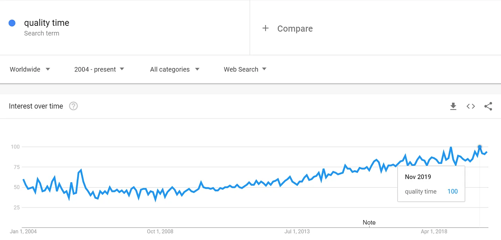
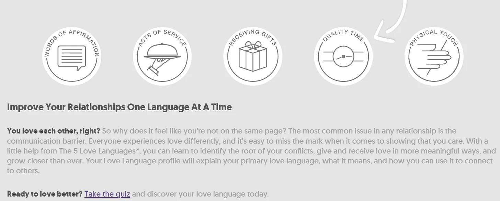
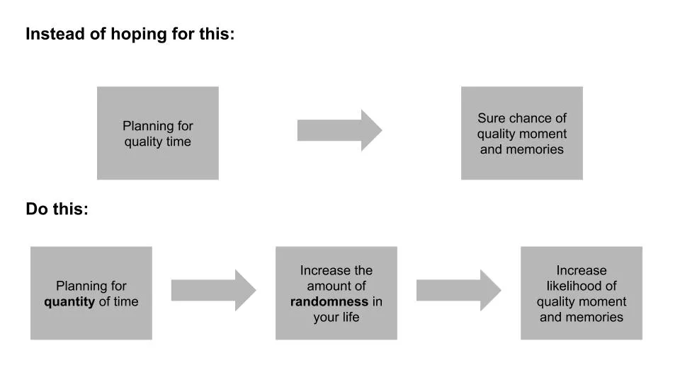

[About Time](<https://en.wikipedia.org/wiki/About_Time_(2013_film)> 'About') is one of my favourite movies ever, and not just because it features Rachel McAdams in yet another time travel movie [^1]. One of the messages it bludgeons your head with at the end of the movie is to treasure every moment of life. Which, despite coming from a rom-com, is actually an important takeaway I believe in.

If we should treasure every moment, what about the concept of quality time then? [Ryan Holiday recently wrote about how he disagrees with the concept entirely:](https://forge.medium.com/theres-no-such-thing-as-quality-time-58db618c099d 'Ryan')

> It’s one of those lines we throw out casually: “I want to spend more ‘quality time'"

> The perfectionist side of our brain \[...\] wants everything to be special, to be “right.” But that’s an ideal that \[we\] can’t always live up to

> The result? An inevitable sense of disappointment

> The reason is that there is no such thing as “quality time.”

Quality time is a concept that has been around a while, with interest in it growing over time.

It's [even one of the love languages.](https://www.5lovelanguages.com/ 'love')

Does this mean we've been living in a collective delusion, trying to chase something that doesn't exist? Ryan thinks so, quoting Jerry Seinfeld:

> “I’m a believer in the ordinary and the mundane. These guys that talk about ‘quality time’ — I always find that a little sad when they say, ‘We have quality time.’ I don’t want quality time. I want the garbage time. That’s what I like."

I mostly agree with Ryan and Seinfeld. **Time spent can be high quality, but chasing quality time itself is fruitless. This is due to a combination of 1) expectations and 2) randomness.**

We desire quality moments and to make quality memories. It's tempting to think that we can create quality time just by designating it so, such as via a vacation. That generally ends up backfiring due to **our raised expectations being let down by reality.** If we expect that our vacation is going to be perfect, any single mistake ruins the experience.

In contrast, you are likely to get a positive surprise when you have low expectations, which is likely the case during a "normal day". It’s hard to match perfection, and easy to beat normal. Because of this, **it's more likely quality moments come out of chance.**

If you can't engineer quality time, and it's more a matter of random events, it follows that you want to increase how often such events happen. You can't increase the probability, but you can increase the duration for such events to occur. Put another way, **you want to increase quantity of time, and not engineer quality time.**

Ryan indirectly implies that duration is the key, by quoting another advisor on how to find that ordinary time:

> “You have to find the moments between moments.”

> Sometimes these awkward, in-between moments allow for conversations that never would have happened otherwise. Even some of my best writing and thinking have come when I was stuck somewhere I didn’t want to be, or doing something I didn’t want to do.

> When you’re out of excuses for being busy \[...\] you’re forced to just make do with what’s in front of you

You want as much time as possible with your loved ones, since that allows more opportunity for randomness to create situations that become memorable moments. If you're not making the time for chance to happen, it's more difficult to get that quality relationship you're looking for. **You don't need quality time, you just need time.**

Sometimes you can't find what you want by looking for it.

[^1]: Yes, I know it received mixed critical reviews. Fight me. Rachel was also in Time Traveller's Wife (meh) and Midnight in Paris (great, and not to be confused with an American in Paris, if not you'll watch half the movie wondering when the musical bit is supposed to come on. Not that it happened to me of course)
