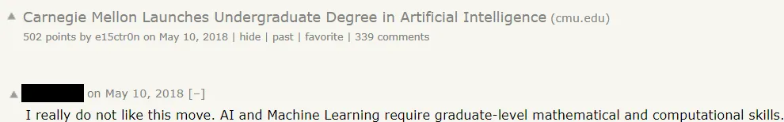
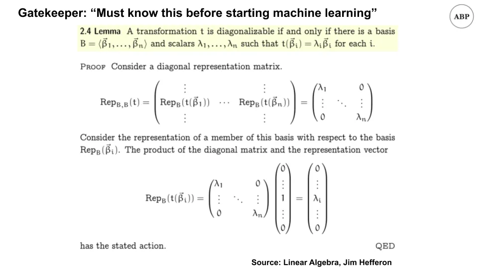
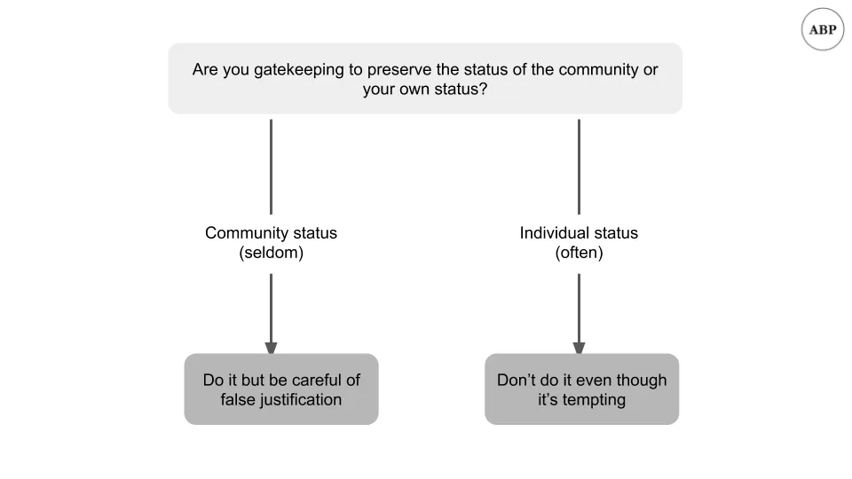
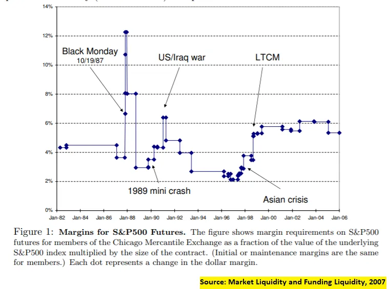
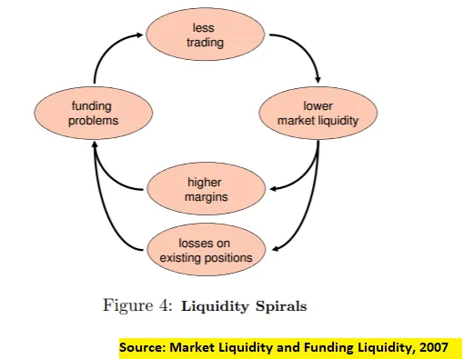

## Takeaways

1. Gatekeeping is usually done to preserve individual status rather than group status, and should be avoided
2. Cost of capital and illiquidity spirals are linked in a feedback loop

## 1. Gatekeeping for group vs individual status

You've seen this before.

A beginner, starry eyed and bushy tailed, will come looking for advice on how to get started in a subject.

And a host of experts will [emerge from the depths](https://youtu.be/Y2fwe0rnHak?t=118 'balrog') to tell them it can't be done, that they should go back and spend years learning the prerequisites, and they should be embarrassed for asking the question in the first place. _"The nerve of some people, thinking they could avoid paying their dues."_

With some "experts" even finding things to complain about when others launch courses to help beginners do just that.

We encounter gatekeeping all the time, and it's mostly done to preserve status. There are some valid forms of gatekeeping, and I'll come to that in a bit. But it's nearly always done to exclude people and be mean. Funnily enough, the gatekeepers never seem to realise that they could be excluded too.

For example, you could say that you can't start machine learning unless you learn calculus, statistics, and linear algebra, just like the commenter above.

And you could also say that you can't start linear algebra unless you learn group theory, how [matrices are a ring](https://www.youtube.com/watch?v=_RTHvweHlhE 'ring'), and [when to work with linear groups or not](https://www.youtube.com/watch?v=AJTRwhSZJWw 'group') [^1]

And you could gatekeep further and say that the above depends on [set theory](https://plato.stanford.edu/entries/set-theory/ 'set'), [Peano axioms](https://en.wikipedia.org/wiki/Peano_axioms 'Peano'), and [philosophy](https://plato.stanford.edu/entries/philosophy-mathematics/ 'philo'). Wonder how much of that the commenter spent his undergrad studying.

If we wanted to, we could gatekeep anything.

**We'd also never get anywhere since we'd never get started.**

There are valid forms of gatekeeping. If you're excluding someone because they would be harmful to the community, that's reasonable. For example, if you're building a group of video gamers, and you get a membership request from someone who wants to ban video games, it probably doesn't make sense to accept her in.

More often though, gatekeeping is an attempt by individuals in the "in-group" to maintain their status, as if they somehow lose out the more people know what they know. It comes from a place of insecurity; from people afraid to let others realise what they do can be done by others too. As I wrote about last month, that's like shorting the lottery, and probably a bad idea. For example, the impressionist painters were all gatekept when they first started, but look at their influence in art now [^2].

Now, note that the gatekeeper's aren't totally wrong. **In fact, their suggestions often make sense.** For example, it would be tremendously helpful to know linear algebra while studying machine learning. And if you want to become an expert, you have to master all the math required [^3]. But artificially preventing people from starting a subject doesn't help anyone. A better response would have been "Yes, here's some simpler courses to get started, come back and revisit the fundamentals after." Enable rather than disable.

If you've been biased towards gatekeeping, I'd encourage thinking about whether you're helping the community, or helping yourself [^4]. If you've self-selected into reading this newsletter, you can do better.

Fields are large enough that the more people pursuing them the better. It's rarely, if ever, a zero-sum game, and more of an [infinite game](https://fs.blog/2020/02/finite-and-infinite-games-two-ways-to-play-the-game-of-life/ 'infinite'). By being open-minded and accepting of beginners, we can grow the entire pie, and have more for ourselves. That's how we can drive progress as individuals; how we have our cake and eat it too.

Open more gates, and [be kind.](https://www.youtube.com/watch?v=xnouj9Yz-Gs&feature=youtu.be&t=23 'who')

## 2. Liquidity spirals

You've also seen this before.

A market is humming along, doing the thing it does market balancing, and matching buyers and sellers. When suddenly a shock occurs, the market freezes up, and the market becomes "illiquid."

For example, [how flour was in short supply a while back](https://www.theatlantic.com/health/archive/2020/05/why-theres-no-flour-during-coronavirus/611527/ 'flour') [^5].

Or how the 08 crisis caused runs on banking institutions, bringing some to bankruptcy.

And recall earlier this year when we discussed that liquidity was the cause of crises, not capital.

Today we'll look at highlights of the paper ["Market Liquidity and Funding Liquidity"](https://www.nber.org/system/files/working_papers/w12939/w12939.pdf 'Markus') by Markus Brunnermeier and Lasse Pedersen. The paper's long and mostly mathematical [^6], but we can still review the conclusions.

Markus and Lasse look at what causes these illiquidity spirals, finding that cost of capital [^7] works in a feedback loop with liquidity. Harder to get funds, lower liquidity, higher volatility.

They first look at margin requirements [^8], and note how they change in response to crises. As expected, margins (taking the role of costs here) become less liquid when there's more uncertainty, and become more liquid when there's less uncertainty.

Another way to reduce liquidity is to reduce capital of the participants:

> Importantly, any equilibrium selection has the property that small speculator losses can lead to a discontinuous drop of market liquidity. This “sudden dry-up” or fragility of market liquidity is due to the fact that with high levels of speculator capital, markets must be in a liquid equilibrium, and, if speculator capital is reduced enough, the market must eventually switch to a low-liquidity/high-margin equilibrium

Which can lead to illiquidity spirals two ways:

> first, a “margin spiral” emerges if margins are increasing in market illiquidity because a reduction in speculator wealth lowers market liquidity, leading to higher margins, tightening speculators’ funding constraint further, and so on

> Second, a “loss spiral” arises if speculators hold a large initial position that is negatively correlated with customers’ demand shock

The first seems self explanatory; what the second means is that if you're a forced seller, the price is going to drop a lot, and you're going to have to sell more.

This leads them to conclusions for both investors and central banks:

For investors, they raise the importance of having a margin of safety, which seems obvious:

> Finally, the risk alone that the funding constraint becomes binding limits speculators’ provision of market liquidity. Our analysis shows that speculators’ optimal (funding) risk management policy is to maintain a “safety buffer.”

More interesting is what they conclude about central banks and monetary policy.

> central banks can help mitigate market liquidity problems by controlling funding liquidity. If a central bank is better than the typical financiers of speculators at distinguishing liquidity shocks from fundamental shocks, then the central bank can convey this information and urge financiers to relax their funding requirements

> Central banks can also improve market liquidity by boosting speculator funding conditions during a liquidity crisis, or by simply stating the intention to provide extra funding during times of crisis

**Which is what you're seeing in today's markets.** Note that there's three separate actions a central bank can do here: 1) convey information, 2) provide funding, 3) just _say_ they may provide funding; they might not even need to do so in the end. In the current crisis, [markets recovered after (3), even though the actual funding provided was small.](https://www.ft.com/content/a1fba7cd-5329-46e6-82a8-57149e409f6c 'fed')

Even the Fed has realised to not be the gatekeeper of last resort.

## Other

1. [A brief history of graphics (youtube video)](https://www.youtube.com/watch?v=QyjyWUrHsFc&list=WL&index=8 'gfx')
2. ["Colour blindness is an inaccurate term"](https://commandcenter.blogspot.com/2020/09/color-blindness-is-inaccurate-term.html 'colour'). As a colour blind person this was cool to read, especially since it had new info
3. ["The long tail turns out toe be a major cause of the economic challenges of building AI businesses"](https://a16z.com/2020/08/12/taming-the-tail-adventures-in-improving-ai-economics/ 'a16z')
4. [Intro to abstract algebra and group theory by Socratica (youtube series)](https://www.youtube.com/watch?v=IP7nW_hKB7I 'aa'). Recommended, suitable for beginners.
5. ["Fusion reactor very likely to work"](https://futurism.com/mit-researchers-fusion-reactor-very-likely-work 'fusion')

[^1]: Having not known about group theory until this year, I'd have to say it's the most fascinating thing I've learnt about the entire year. It really helped in giving me intuition behind why we define algebra "things" and "operations" the way we do. Why is matrix multiplication not commutative, for example?

[^2]: Impressionists first got their name [from critics ridiculing them for their "unfinished" artwork that were mere "impressions"](https://smarthistory.org/how-the-impressionists-got-their-name/ 'art')

[^3]: To be clear - I agree that in order to become good at machine learning, you'll want to be good at calculus, stats, linear algebra etc. The commenter is right in that regard. I disagree that we should gatekeep people for years because they haven't learnt all that's needed

[^4]: I've skipped discussion about safety issues e.g. you _should_ gatekeep someone from free soloing if they've never climbed anything before. I trust in the reader to have common sense here; hopefully that's not too much of an ask

[^5]: You'll notice I didn't use toilet paper as an example. That's because I have a strong opinion against a popular TP medium article that went viral a while ago which I believe to be mostly inaccurate. I'm planning to write about it and those kinds of "here's a counterintuitive explanation" articles that are not counterintuitive but just wrong; haven't had time for it yet.

[^6]: Also, full disclosure that I don't fully understand the math in the paper. Particularly, there's a speculator skewed return conclusion that I don't quite follow.

[^7]: For readers unaware of what cost of capital means, think of it as the cost of funding. I wrote about it more previously [here](https://leonlins.com/writing/2020_09_16_capital/ 'sub')

[^8]: "When a trader — e.g. a dealer, hedge fund, or investment bank — buys a security, he can use the security as collateral and borrow against it, but he cannot borrow the entire price. The difference between the security’s price and collateral value, denoted as the margin, must be financed with the trader’s own capital"
