## Takeaways

1. The Kelly criterion is a mathematical way of sizing your portfolio, though be careful with your assumptions
2. HASH.ai is making agent based simulations easier; I try to model startup failure rates

## 1. Kelly criterion for portfolio sizing

Sarah is an aspiring angel investor. Her friends Nicholas, Alyson, and Chase have a magical business idea involving pest extermination, and Sarah thinks it's going to be a huge hit.

Sarah was about to invest three lifetime's worth of her savings into this business, when her other group of friends [^1] Seth, Marc, Emma, and Amber pitch her an equally exciting idea involving bunnies.

It dawns on Sarah that she has multiple choices, and she isn't sure what to do. She goes to consult with her older friend Anthony, who watches the investing space closely. Anthony says she's on the right path - portfolio allocation and risk/reward payoffs are the key to becoming a successful investor. He also adds that she might want to read about the [Kelly criterion,](https://www.princeton.edu/~wbialek/rome/refs/kelly_56.pdf 'Kelly') a formula for bet sizing.

The Kelly formula was developed by John Kelly at Bell Labs. It takes a few inputs and returns you the **optimal percentage of your capital to bet on something,** assuming you want to maximise long term returns. I've posted a simplified derivation in the appendix, and you can also find it [here](https://blogs.cfainstitute.org/investor/2018/06/14/the-kelly-criterion-you-dont-know-the-half-of-it/ 'derive') or in the original paper.

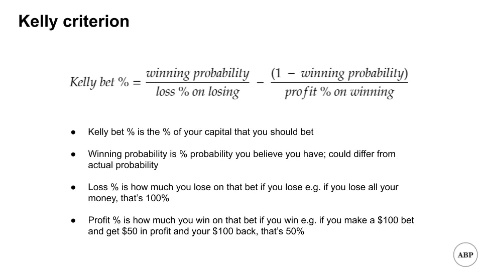

I know math is scary, so let's illustrate with an example. You want to know how much to bet on a coin toss, where you either double your money or lose your bet. If you plug in the numbers:

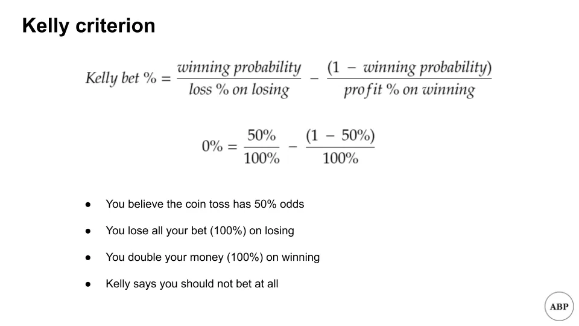

Yes, you read that right. Kelly says that you should avoid risking anything at all. Why?

Since you have no edge, and the risk/reward is sized correctly, the best option is to not bet.

Now, imagine instead that the same coin toss paid you 11x return (1000%) on your bet, with everything else staying the same. If you plug in the numbers:

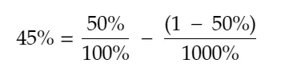

Kelly says that you should bet 45% of your total capital. Notice that even with such attractive odds, you're not betting all your money [^2]. You can also see that in games where you can lose all your bet, you never go all in unless you believe you have a 100% chance of winning.

[Michael Mauboussin and Ed Thorp elaborate on the attractive features of the Kelly system:](http://www.capatcolumbia.com/MM%20LMCM%20reports/Size%20Matters.pdf 'Michael')

1. The chance of ruin is “small.” Because the Kelly system is based on proportional bets, losing all of your capital is theoretically impossible, though there will still be volatility spikes
2. The Kelly system is highly likely to grow a bankroll faster than other systems
3. You tend to reach a specified level of winnings in the least average time

How can this help us on the angel investing side? We'll have to make some highly simplifying assumptions [^3], but Kelly can help give us some idea of how much to allocate per investment.

We know that Kelly takes three inputs - our belief of what the winning probability is, the percentage loss, and the percentage profit. [Correlation Ventures and Seth Levine](https://www.sethlevine.com/archives/2020/10/vc-fund-returns-are-more-skewed-than-you-think.html 'Seth') have a nice chart below showing VC returns over time, and I'll use that as the basis for my assumptions.

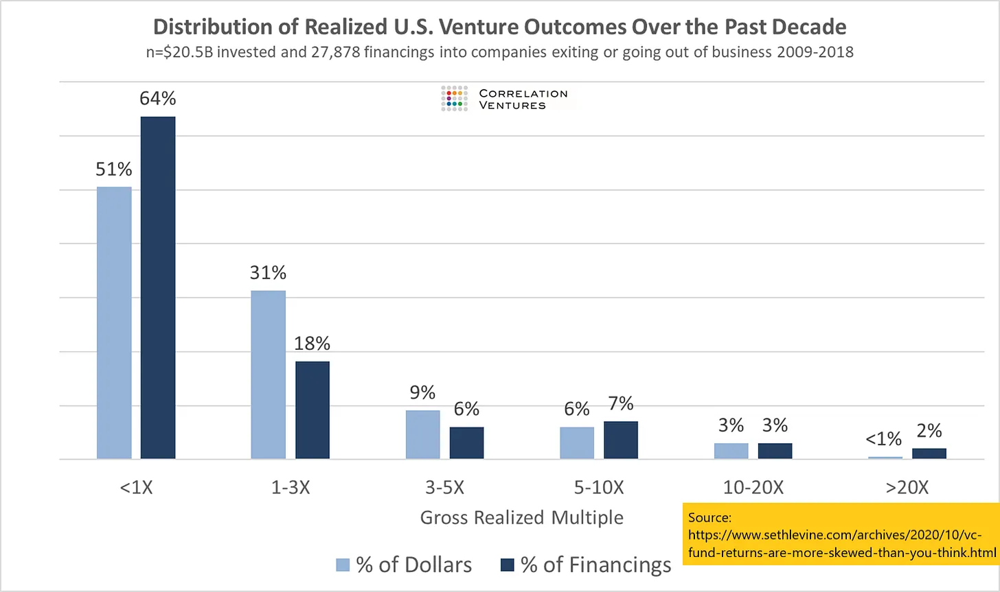

To simplify things, I'm just going to consider anything that's 10x return (900%) or more as a win, and everything else as a loss. From the graph, that means we win about 5% of the time. I'll simplify even further by assuming that we lose 100% of our bet on a loss, and win that 900% profit on a win. Under these initial assumptions, we get:

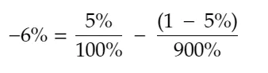

Welp. That's not good. Under our current assumptions, Kelly says that VC investing is a bad deal. When I first saw this, I did a double take, and then wondered how I was going to finish writing this newsletter issue [^4]. The answer I came to was to cheat. A lot.

Instead of the 5% win rate, let's say that angel investors go into an investment having faith they're above average, and that their investments will at least return their money. They believe that their win probability is higher than the base rate. You don't bet on something unless you believe you have an edge vs the odds.

In other words, we'll ignore all of that <1x part on the graph, and assume our universe is just the remainder. That 5% win rate jumps to about 14% [^5]. We'll keep everything else constant. Under these new assumptions, we get:

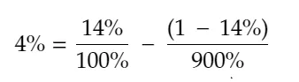

Which is at least something we can work with. Bear with the assumptions for now and we'll revisit them later.

To see what our returns could look like, let's also assume we make 100 such investments in a row. We'll run 1,000 simulations of what such a portfolio could look like i.e. imagine 1,000 universes where we invest in 100 companies under the assumptions above. [I'm using this Colab file here if you want to follow along](https://colab.research.google.com/drive/1YeMnl2QOQdCAGGxCDr2pfDk_HFgCh02D?usp=sharing 'Colab')

Unsurprisingly, our rigged game shows us making a lot of money:

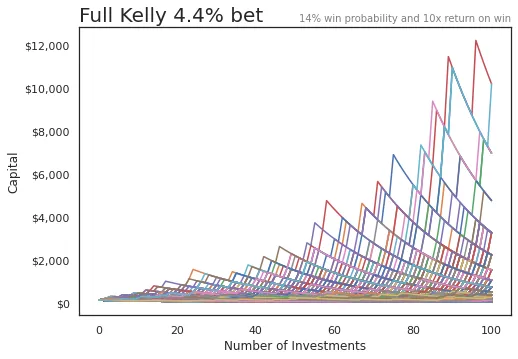

A few things to note though. Look at the huge drawdowns (all the declines) that happen. Many of the portfolios lose more than half their money by the end. Returns have huge volatility spikes.

Also, we ran _one thousand_ simulations. While the large returns stand out on the graph, there really aren't that many of them. The majority of the cases are all smushed together near the bottom.

In order to reduce risk, many people often adopt a "Fractional Kelly" approach, where they bet some smaller percentage of the Kelly recommended size. We'll do that here as well, simulating scenarios where we only bet half of what was recommended (2%).

Let's take a closer look at the return distribution for both of these cases. It's hard to see, but the box plots show the typical 25th, median, 75th percentile ranges of returns. We started at $100:

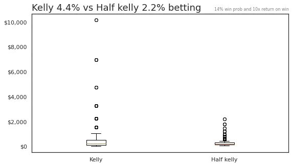

If we ignore the outlier cases, we can see that the 25th to 75th percentile of the returns for all simulations are in a much smaller range.

And if we zoom into the "safer," Half Kelly approach, we see that most of the time you're getting less than 5x returns.

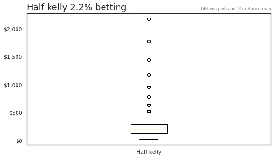

**The takeaway is that if you're angel investing, you need high conviction, would likely want to do many investments, and only invest small percentages of your capital at a time.** Even then, the likelihood of the mythical 100x return is still low. Bear in mind that this is under the optimal betting strategy, and we already rigged the game in multiple ways:

- We removed a huge section of losers
- We assumed a binomial outcome
- We assumed fixed win and loss payouts
- We assumed bets occur one after the other
- We assumed we could make many bets

None of these are what real life is like; the above is a vast oversimplification. That said, **we can at least use Kelly to reduce the risk of ruin.**

If you want to dig further, there's a paper by Vasily Nekrasov [here](https://papers.ssrn.com/sol3/papers.cfm?abstract_id=2259133 'paper') that has a much better model, but the math is beyond me. The python colab file is [here](https://colab.research.google.com/drive/1YeMnl2QOQdCAGGxCDr2pfDk_HFgCh02D?usp=sharing 'colab') if you want to play around with the base simulation assumptions [^6].

### For more on the Kelly criterion:

1. [The Kelly Criterion: Multiple Investment Opportunities by Christian Aichinger](https://greek0.net/blog/2018/04/17/kelly_criterion2/)
2. [The Kelly Criterion: You Don’t Know the Half of It by Alon Bochman](https://blogs.cfainstitute.org/investor/2018/06/14/the-kelly-criterion-you-dont-know-the-half-of-it/)
3. [Python Risk Management: Kelly Criterion by Lester Leong](https://towardsdatascience.com/python-risk-management-kelly-criterion-526e8fb6d6fd)
4. [Practical Implementation of the Kelly Criterion by Andrea Carta and Claudio Conversano](https://www.frontiersin.org/articles/10.3389/fams.2020.577050/full)
5. [What AngelList Data Says About Power-Law Returns In Venture Capital by AngelList](https://angel.co/blog/what-angellist-data-says-about-power-law-returns-in-venture-capital)

## 2. Using HASH.ai to simulate company survival rates

We'll move on from one model full of assumptions, to another model full of assumptions. I recently heard of the company [HASH.ai](https://hash.ai/ 'hash'), which lets you "build multi-agent simulations in minutes." By that, they mean creating multiple objects that can interact with each other, and then seeing what happens. You can read more about agent-based modeling [here](https://hash.ai/blog/what-is-agent-based-modeling 'hash')

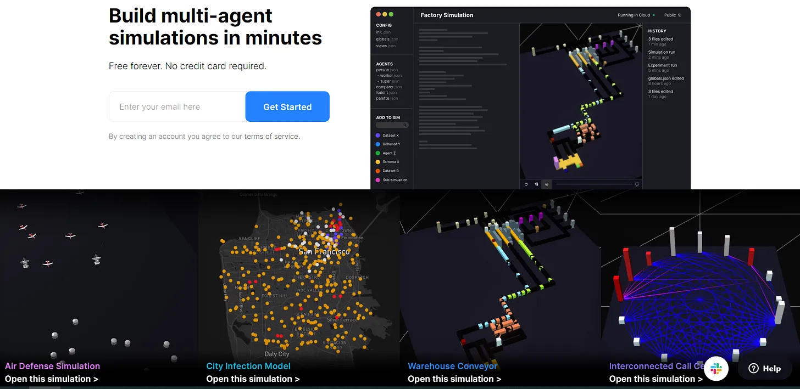

I wanted to play around with the tool [^7], simulating some of the assumptions we made in the earlier sections. Some reasons VC investing is hard are because so many companies fail, or don't grow fast enough vs expectations. Let's model some companies growing in an economy.

Again, I'll make simplifying assumptions:

- We know average company survival rates on a yearly basis. I abuse probability to make an assumption for a daily survival rate
- Based on that I also infer a daily failure rate
- We also know average company revenue growth rates on a yearly basis. From that I infer a hacky daily growth rate

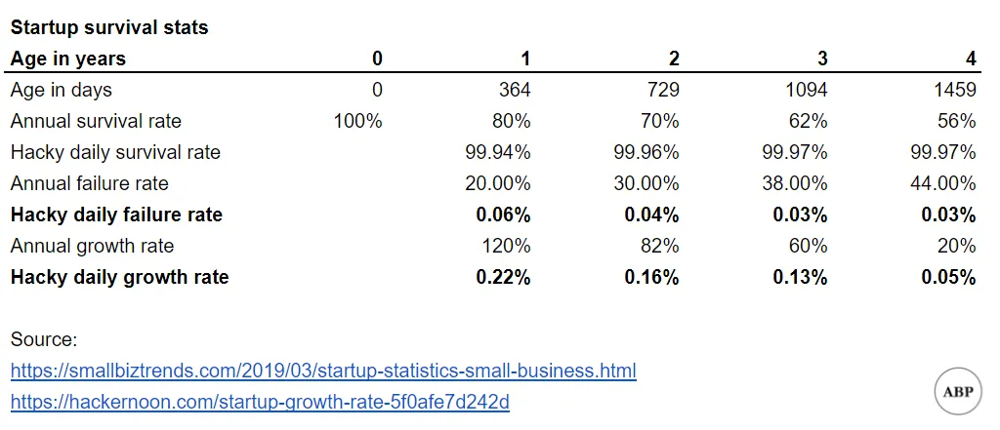

I put all of that into a HASH.ai project, modifying one of their templates. It took a bunch of tinkering since many files are in Javascript and... I do not know Javascript. But I think I got it to mostly work in the end [^8].

The model simulates companies as green boxes, growing in height every day, with the height representing company size. At any time period, there's a chance that the company fails, represented by the box burning up in flames [^9]. We can see how many companies survive over long periods of time. Here's a sample run:

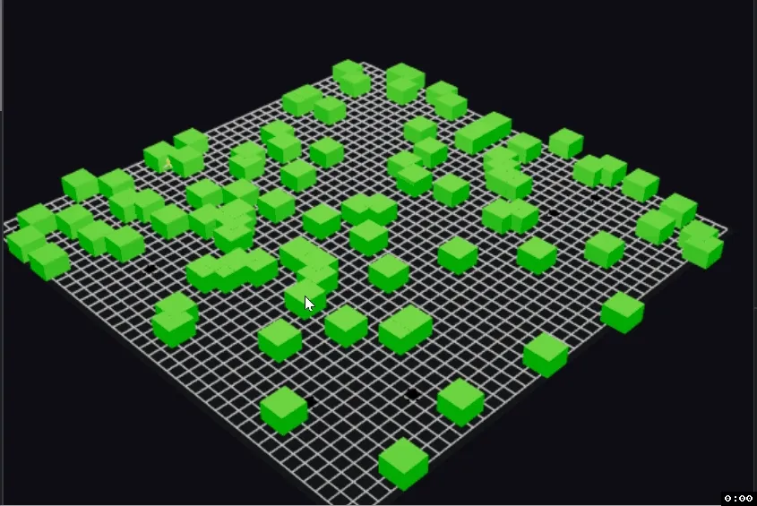

Under the current assumptions, there were a lot more survivors than I thought there would be, though it took a long time before we saw any 100x companies. Could probably go back and tweak the assumptions.

HASH.ai also lets you graph stats over time. My current model shows a steady state of survivors vs failures.

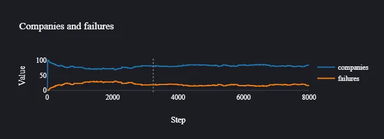

Again, this was just for fun, and most of the assumptions need to be adjusted. The final model is [here](https://core.hash.ai/@leonlinsx/wildfires-regrowth-3/main 'model') if you want to play around with it. Would be interested in seeing someone create a more sophisticated model of startup growth.

## Other

1. [Unit economics of vending machines](https://thehustle.co/the-economics-of-vending-machines/ 'econs')
2. [Online game networking explained](https://www.pcgamer.com/netcode-explained/ 'netcode')
3. [What we can learn from War and Peace and a napkin about risk.](https://refractor.substack.com/p/the-story-range? 'refractor')
4. [American PhDs are failing at start-ups](https://marginalrevolution.com/marginalrevolution/2020/12/american-ph-ds-are-failing-at-start-ups.html 'phd')
5. [This isn't Sparta](https://acoup.blog/2019/08/16/collections-this-isnt-sparta-part-i-spartan-school/ 'sparta')

## Appendix

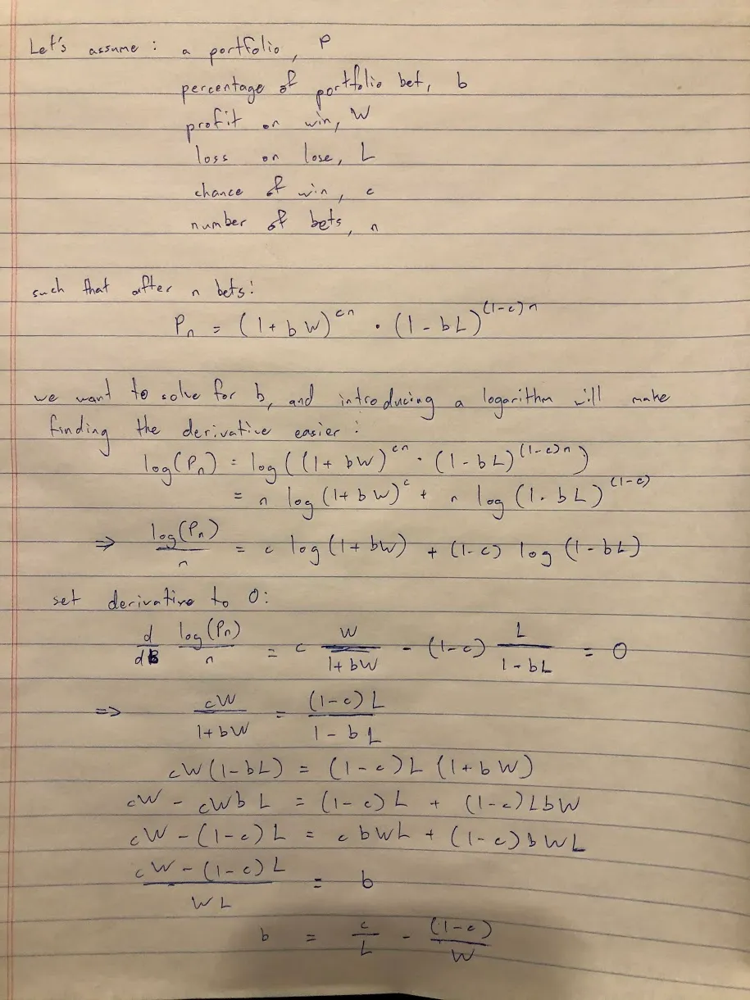

[^1]: Sarah's killing it in the friend department

[^2]: There's also the unrelated point that if you ever see such attractive odds, you're probably being scammed

[^3]: I want to re-emphasise how much we're simplifying here. For one, the illiquidity of angel investments is a huge problem since you don't have a repeated, continuous bet nature that we run later in the simulations. Also, sidenote that I could have easily gotten any of the math wrong, please correct me if you see mistakes.

[^4]: Plan ahead, they say...

[^5]: 5% divided by (100% minus 64%)

[^6]: You'll notice that small tweaks to the winning probability from where it currently is will dramatically change the suggested bet percentage and predicted returns

[^7]: Emphasis on play. My final model is super janky.

[^8]: You'll notice references to trees, fires, and more in the code, which is leftover from the original model simulating wildfires.

[^9]: I want to say this was intentional; I couldn't figure out how to change a lot of the features.
