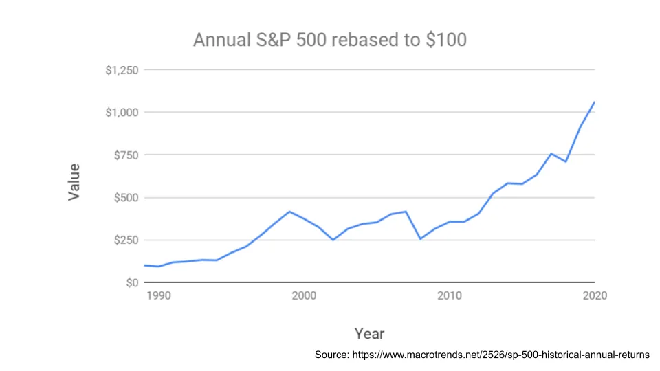
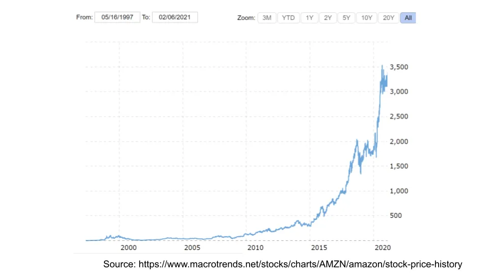

## Takeaway

Behavioural edge in investing comes from being able to do things that are unpopular. Everyone loves to gamble, the more important thing is to size your risk appropriately.

## Behavioural edge and why it's difficult

John Huber likes to divide the "edge" you can get in investing into [three main sources:](https://sabercapitalmgt.com/what-is-your-edge/ 'edge')

1. Information advantage - you have more/better information
2. Analytical advantage - your analysis of that information is better
3. Behavioural advantage - your mindset and actions

I believe that information and analytical advantages continue to shrink, and are already not very large, even for the pros. Remember that it is the [relative difference](https://leonlins.com/writing/2020_05_07_relative_billionaire/ 'relative') that matters, and not the absolute level. If you're using satellite data and your competitor is too, you do not have an information edge. If your detailed diligence process is the same as that of another [Tiger cub](https://en.wikipedia.org/wiki/Tiger_Management 'Tiger') because your bosses used to work together, you do not have an analytical edge.

I also believe that the behavioural advantage is not shrinking, and will continue to be a differentiator for financial returns. The speed of information transfer has changed, analytical methods are well known, but humans still behave the same.

Some examples of behavioural edge:

**Short term vs long term.** If you'd put $100 in the S&P 500 in 1990, you'd have 10x your money this year. That sounds like a big number.

On average though, you'd have earned ~8% a year. That sounds like a small number.

That difference in "feeling" there is why people can earn the big number. Compounding takes time to do its work; you get paid for patience.

**Risk vs ruin.** When thinking about investing for the long run, it doesn't matter how much you make, if you lose it all. A 10,000% gain followed by a 100% drop is still a horrible outcome. Avoiding the risk of ruin, and "staying in the game" is the only thing that matters. Don't take it from me, here's both Howard Marks and Charlie Munger:

> 'Thus, rather than merely searching for prospective profits, we place the highest priority on preventing losses. It is our overriding belief that, especially in the opportunistic markets in which we work, "if we avoid the losers, the winners will take care of themselves."' - Howard Marks

> "It is remarkable how much long-term advantage people like us have gotten by trying to be consistently not stupid, instead of trying to be very intelligent." - Charlie Munger

**Doing nothing vs doing something.** Professional money managers are incentivised to turnover their portfolio, since they themselves have clients to cater to. Imagine the following meeting:

> Client - "So, what's new in the portfolio?"

> Investor - "Nothing, we're still in the book store we mentioned."

> Client - "Wasn't that the same stock from last year?"

> Investor - "Yep, and the same one from four years ago. We haven't actually done anything."

> Client - "What am I paying you for then?"

That's why we see stocks like Amazon >100x in our lifetime, and don't see active managers do the same. If everyone else _has_ to make trades to keep their job, doing nothing might actually give you an edge.

**Boring vs exciting.** Why are the above behaviours difficult? Because they're _boring_. We like activity and hate staying still. It's hard to brag at a cocktail party that your gains are small, slow, and simple. Just like how ["sin stocks" need to have higher expected excess returns](https://www.aqr.com/Insights/Perspectives/Virtue-is-its-Own-Reward-Or-One-Mans-Ceiling-is-Another-Mans-Floor 'asness'), "boredom" stock behaviours also give you an edge.

Having suggested all the above, am I expecting anyone to follow it? Should we just buy the S&P and go to sleep?

Nah, not really. Lord, make me chaste - but not yet. It's a great plan, but too difficult for most people to follow. Keeping in mind that this is not investment advice, let's add a small tweak to the portfolio:

One big reason people fail to follow such a plan is that **we all love gambling.** We'll see opportunities that seem too good to be true (hint: they are), and are tempted to join in. I do that all the time, despite knowing all the above.

Knowing that's the case, **having a small percentage of the portfolio dedicated for wild bets** seems like a reasonable compromise for our own fallible behaviour. Rather than resisting temptation forever (unlikely), a better approach is to pre-empt the behavioural challenges likely to occur.

A lot of the common financial knowledge is good advice (diversify, low cost investments etc), but we often fail to account for the fact that people want an outlet to gamble. This ends up backfiring when people can't resist any longer and take on too much risk in a moment of weakness. It doesn't help that you invested in an index fund for 10 years before pulling it out to short a stock with unlimited downside.

Instead, say you set aside 5% of your capital to invest in [Fyre festival time shares](https://en.wikipedia.org/wiki/Fyre_Festival 'fyre') and the latest pump and dump scheme. You'll be able to satisfy both the gambling urge whenever it arises, but never be in a position to risk your livelihood. It's a somewhat similar approach to the [Kelly criterion](https://leonlins.com/writing/2020_12_02_kelly/ 'kelly') that we discussed before.

If you lose all the 5%, that's too bad, but you've capped your downside and have to further reduce risk if you want to bet again. And if you've stumbled upon the next Amazon, that's fantastic.

**The best investment plan is the one that you can actually stick with.** It may not be the financially optimal solution, but is a behaviourally focused one that might help you scratch the gambling itch.
