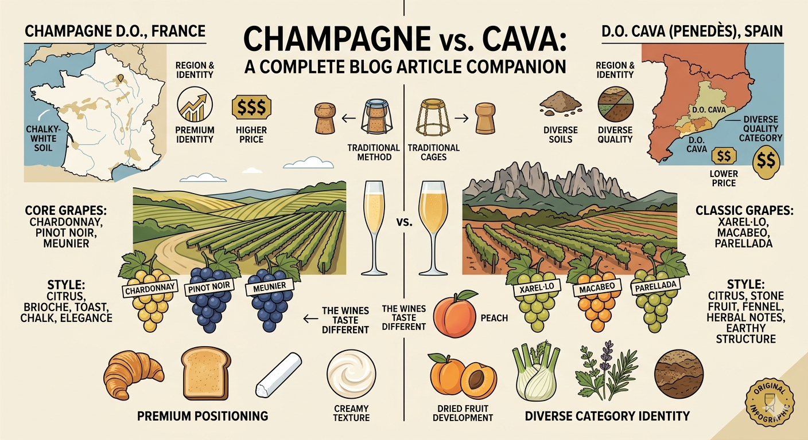
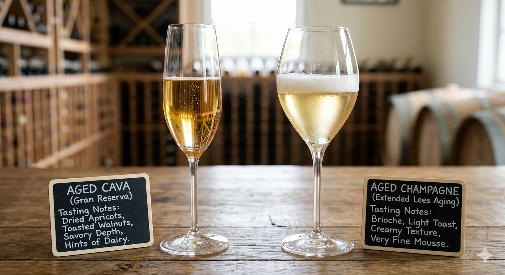

Cava and Champagne are both **traditional method sparkling wines**, which means the bubbles come from a second fermentation in bottle. The main difference is not that one is “real” and the other is a lesser substitute. The real differences are **place, grape varieties, style, and price positioning**. 

Champagne is the world’s best-known sparkling wine name, while Cava is less famous internationally and often priced lower, even though it can be made to just as good of a standard as Champagne.

I've found that Champagne tends to be more lean, crisp, with more minerality, Cava is more lively, fruity, and less austere.

For a brief overview, you can also explore the [Cava Wine Style](/wine/styles/cava), [Champagne Wine Style](/wine/styles/champagne), [Penedès Wine Region](/wine/regions/penedes), and [Champagne Wine Region](/wine/regions/champagne) hubs.

# Summary

- **Cava** is a traditional method sparkling wine from Spain, often offering better value.
- **Champagne** is a traditional method sparkling wine from France and the world’s best-known sparkling-wine category.
- Both are bottle-fermented sparkling wines, but they differ in **region, grapes, style, and price positioning**.
- Great Cava is not “cheap Champagne.” It is a different category with its own strengths, especially around value, native grapes, and food-friendliness.
- If you are buying your first bottle, choose based on **budget, occasion, and style preference**, not category status alone.

# Cava vs Champagne: the short answer

If you only want the short version:

- Choose **Cava** if you want value, versatility, and a sparkling wine that often works beautifully with food.
- Choose **Champagne** if you want the most famous benchmark for sparkling wine and are happy to pay more for that regional name and category status.
- If you want a serious bottle, both categories can deliver—just not always at the same price.

For many beginners, Cava is the smarter place to start. It lets you learn about traditional-method sparkling wine without immediately paying Champagne prices.

# What Cava and Champagne have in common

The biggest similarity is that both are made by the **traditional method**, with a second fermentation in bottle. That shared method is why both can show fine mousse, freshness, and complexity from lees aging.

Both categories also have meaningful quality differences within them. In Cava, the top-end categories include **Reserva**, **Gran Reserva**, and **Paraje Calificado**, all of which require longer bottle aging than basic **Cava de Guarda**. In Champagne, producer style, non-vintage versus vintage, and prestige bottlings can play a similar role in signaling seriousness and intended complexity.

So if you already like Champagne, Cava is not some unrelated bargain fizz. It belongs in the same broader world of bottle-fermented sparkling wine, even though it expresses that world differently.

# The biggest differences

## 1. Region and identity

Champagne can only come from the **Champagne region of France**. Cava is a Spanish appellation historically centered on **Catalonia, especially Penedès**, though the Cava D.O. is not identical to one single region in the way Champagne is.

That matters because sparkling wine is not just about method. It is also about climate, soils, grapes, and local tradition. For example, Champagne's chalk soils are typically cited as a reason for the minerality of the wines made there.

## 2. Grapes

Champagne’s core grapes:
- **Chardonnay** often brings precision and elegance
- **Pinot Noir** often adds body and structure
- **Meunier** often adds fruit and approachability

Classic Cava:
- **Xarel·lo** often adds structure, herbal notes, and aging potential
- **Macabeo** often adds softness and generosity
- **Parellada** often brings lift and delicacy

This is one of the biggest reasons the wines do not taste the same, even when the production method is similar.

## 3. Style

Champagne often shows flavors that beginners describe as:
- citrus
- apple
- brioche
- toast
- chalk
- creaminess

Cava can overlap in freshness and bottle-fermented character, but serious examples often lean more toward:
- citrus and stone fruit
- fennel or herbal notes
- earthy or savory structure
- dried-fruit development with age

That is especially true when **Xarel·lo** plays a major role. It is one of the grapes that gives serious Cava its structure and distinct personality.

## 4. Price and category positioning

Champagne is usually more expensive, but that does not automatically mean it is always better in the glass. Part of what you are paying for is a region with extraordinary recognition and a very strong premium identity.

Cava usually sits at a lower price point, but that should not be confused with a lack of quality. One of Cava’s challenges is that inexpensive mass-market bottles and fine long-aged bottles share the same category name, so the top wines often do not get the same recognition they deserve. The Cava regulatory organisation is making an effort to distinguish these categories to help consumers differentiate.

# Aging and texture

Both wines gain complexity from time on the lees, but they do not always express that aging in the same way.

In Cava, longer aging often shows as a move from **fresh fruit to dried fruit and savory depth**, rather than simply more overt brioche character. In Champagne, many drinkers more readily associate extended lees aging with toast, brioche, cream, and very fine mousse.

I've sometimes found more dairy notes in aged Cava.

One important point for beginners: the legal minimums are only minimums. In Cava, **Reserva**, **Gran Reserva**, and **Paraje Calificado** require at least **18, 30, and 36 months** respectively, but respected producers often age their wines much longer.

That is one reason it is too simplistic to treat Cava as inherently less serious than Champagne. Cava can offer long-aged traditional-method wines at a much lower price.

# Price and value

This is where the beginner choice often becomes easiest.

If your budget is modest but you still want a bottle-fermented sparkling wine with real character, **Cava is often the better value**.

If your goal is:
- the most famous name
- a classic gift bottle
- the Champagne regional identity

then Champagne is the more obvious choice.

But if your goal is:
- strong value
- food-friendly sparkling wine
- exploring serious traditional-method wines without prestige pricing

then Cava is often the smarter buy.

# Which should a beginner buy?

## Choose Cava if:
- you want better value
- you want to explore sparkling wine without paying Champagne prices
- you are curious about native Spanish grapes like **Xarel·lo**

## Choose Champagne if:
- you specifically want the classic Champagne profile and associations
- you are buying for a milestone or formal gift
- you want the region that remains the global benchmark for sparkling wine

## If you want something more savory or structured
Try a more serious aged **Cava**, especially one with more aging or stronger Xarel·lo presence.

## If you are buying your first bottle
Start with:
- a good **Cava Reserva** if value matters most
- an entry-level **Champagne** if you want to understand the benchmark directly

# Final thought

Cava is not “cheap Champagne.” It is a different category of traditional-method sparkling wine with its own grapes, its own culture, and its own strengths. Champagne remains the world’s most famous sparkling-wine name, but great Cava offers something very appealing: real quality, distinctive personality, and often much better value.
