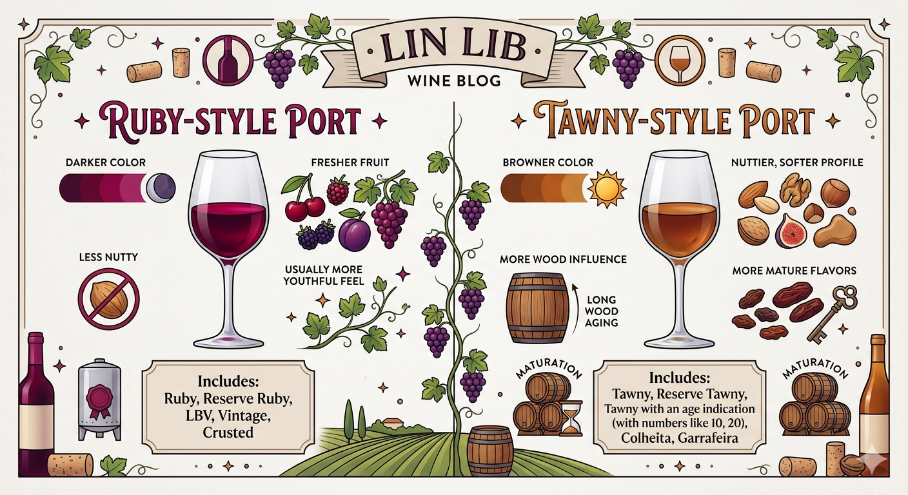
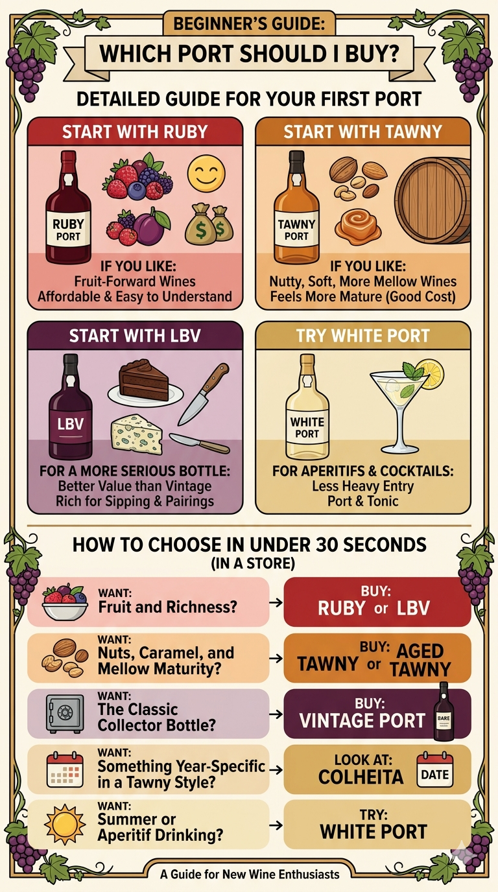

Port is not one wine. It is a whole family of fortified wines from Portugal’s Douro Valley, and the style names on the label tell you a lot about what to expect in the glass. For beginners, the most useful split is Ruby vs Tawny: **Ruby Ports are usually fruitier and less oxidized, while Tawny Ports are usually nuttier, softer, and shaped more by time in wood**.

If you only remember a few names, start with **Ruby, Tawny, LBV, and Vintage**. Those are the styles you will see most often. But Port includes more than that: **White Port, Rosé Port, Colheita, Crusted, Garrafeira, Reserve Ruby, Reserve Tawny, and aged Tawny** are all worth knowing at least in broad terms.

Once you understand the basic style families, it becomes much easier to choose the right bottle for dessert, cheese, sipping, gifting, or simply learning the category.

For a quick overview, you can also explore the [Port Wine Style](/wine/styles/port) and [Douro Wine Region](/wine/regions/douro) hubs.

# Summary

- Port is a **fortified wine from Portugal’s Douro Valley**.
- The two big style families are:
  - **Ruby-style** Port: fruit-driven, darker, less oxidized
  - **Tawny-style** Port: nuttier, browner, more oxidative
- The most useful beginner styles to learn first are:
  - **Ruby**
  - **Tawny**
  - **LBV**
  - **Vintage**
- Other important but less common styles include:
  - **White Port**
  - **Rosé Port**
  - **Colheita**
  - **Crusted**
  - **Garrafeira**

# What Port is

Port is a fortified wine made in Portugal’s Douro Valley. During fermentation, grape spirit is added, which stops fermentation early and leaves the wine sweet [^1]. That is why most Port styles are both **sweet and alcoholic**, rather than dry like table wine. Note that the addition of spirit means that Ports are typically higher in alcohol.

[^1]: Fermentation converts sugar to alcohol. If the fermentation is stopped early, there is still residual sugar that has not been converted.

Different Port styles can be fruity, nutty, fresh, youthful, mature, casual, serious, affordable, or age-worthy, depending on how they are matured. 

# The two main Port families

## Ruby-style Port

Ruby-style Ports are protected from oxidation during maturation, so they keep a deeper color and more youthful fruit.

Think:
- darker color
- fresher fruit
- less nutty
- usually more youthful in feel

Ruby-style Ports include:
- Ruby
- Reserve Ruby
- LBV
- Vintage
- Crusted

## Tawny-style Port

Tawny-style Ports spend longer in wood and develop more oxidative character.

Think:
- browner color
- nuttier, softer profile
- more wood influence
- more mature flavors

Tawny-style Ports include:
- Tawny
- Reserve Tawny
- Tawny with an age indication
- Colheita
- Garrafeira

# The main Port styles beginners should know

## Ruby Port

Ruby Port is the basic youthful ruby style. It is usually a blend of more than one year, aged in bulk and bottled fairly young to preserve fruit. This is the entry level style meant to be affordable and easy to drink.

Expect bold fruit, sweetness, darker color, for a simple style.

Good for beginners, chocolate desserts, everyday Port drinking.

## Reserve Ruby Port

Reserve Ruby is a step up from basic Ruby, usually made from better grapes and often aged a little longer before bottling.

Expect more concentration, richer fruit, but still youthful and fruit-driven flavours.

Good for someone who likes Ruby but wants a bit more depth, easy gifting at a modest budget.

## LBV (Late Bottled Vintage)

LBV stands for **Late Bottled Vintage**. It is from a single year, but bottled later than Vintage Port, usually **between four and six years after harvest**. 

There are two broad LBV styles:
- **filtered LBV**, ready to drink on release
- **unfiltered or traditional LBV**, more structured and more capable of bottle aging

Expect darker fruit flavours, more flavour intensity than basic Ruby, and better value compared with Vintage Port

Good for beginners who want something more serious without jumping to Vintage Port, or people who want a richer style without huge cost. I've heard producers say that in recent years the quality of LBV rivals that of Vintage Port, given improvements in wine making [^2].

[^2]: Producers do not want to make too many years of Vintage Port, to avoid diluting brand value.

## Vintage Port

Vintage Port is one of the classic prestige styles of Port. It is made from a single year and only in years a producer chooses to declare. This is meant to be treasured and enjoyed for special occasions.

Vintage Port is bottled relatively young and then ages in bottle for many years, often decades. Note that it is meant to be aged by the consumer.

Expect power, concentration of fruit, structure, sediment from the ageing, and long aging potential

Good for collectors, gifting, long-term cellaring, contemplating life

## Tawny Port

Basic Tawny Port is the entry-level tawny style. It is softer and more oxidative than Ruby, but not necessarily very old or very complex.

Expect lighter color than Ruby due to the oxidation, some nutty notes, and softer, more mellow sweetness

Good for beginners who prefer nuttier over fruitier styles, simple dessert pairings

## Reserve Tawny Port

Reserve Tawny is a better-quality tawny blend, usually with more wood age and more complexity than basic Tawny.

Expect more complexity than basic Tawny, more caramel, dried fruit, nutty notes, and softer, smoother feel

Good for beginners ready to explore tawny styles, cheese, nuts, caramel desserts

## Aged Tawny Port (10, 20, 30, 40 years, and beyond)

These are tawny Ports labeled with an age indication. The number is not a vintage year. It indicates the style profile the blender is aiming for. This would be for a person who likes the tawny nutty profile and wants more of that

Expect more nutty, caramel, dried-fruit complexity as age rises, more elegance and softness, less youthful fruit

Good for sipping after dinner, aged cheese, gifting, people who like complexity more than raw fruit

## Colheita Port

Colheita is a tawny-style Port from a **single harvest year** that has been aged in wood. This is the tawny version of vintage port.

## Crusted Port

Crusted Port is one of the least-known classic Port styles. It is a blend of multiple harvests, bottled without fining or filtration, so it throws a deposit or “crust” in bottle.

It behaves a bit like a more affordable Vintage Port.

## White Port

White Port is made from white grapes, rather than the typical black grapes for other ports. Most examples are bottled young, but some wood-aged examples can also carry age indications or be released as Colheita. It is popular for cocktail usage particularly.

Depending on the style, expect:
- fresh, sweet, floral, stone-fruit notes in younger styles
- more nutty, oxidative complexity in wood-aged styles

Good for aperitif drinking, Port and tonic cocktails, warm weather drinking, people who want to try Port outside the classic red dessert context

## Rosé Port

Rosé Port is a relatively modern style and is usually more casual and cocktail-friendly than the classic Port categories. It was made to capitalise on the rosé trend in wines.

Expect bright berry fruit, lighter feel than many red Ports, more casual, easy-drinking style

Good for summer drinking, cocktails, beginners who are not yet ready for more traditional Port styles

# Which Port should a beginner buy?

If you want the simplest buying guide:

## Start with Ruby if:
- you like fruit-forward wines
- you want something affordable and easy to understand

## Start with Tawny if:
- you like nuttier, softer, more mellow wines
- you want something that has more oxidised aromas

## Start with LBV if:
- you want a more serious bottle
- you want better value than Vintage Port
- you want something rich for chocolate, blue cheese, or sipping

## Try White Port if:
- you want an aperitif
- you want to make a Port and tonic
- you want a lighter entry into the category

## How to choose in under 30 seconds

If you are in a store and want the fastest possible guide:

- Want **fruit and richness**? Buy **Ruby** or **LBV**
- Want **nuts, caramel, and mellow maturity**? Buy **Tawny** or **Aged Tawny**
- Want **the classic collector bottle**? Buy **Vintage Port**
- Want **something year-specific in a tawny style**? Look at **Colheita**
- Want **summer or aperitif drinking**? Try **White Port**

# Final thought

Port becomes less intimidating once you stop thinking of it as one single type of wine. It is really a family of styles, and the label usually tells you which family you are in.

For beginners, the best path is simple:
- learn the Ruby vs Tawny split
- taste LBV and Vintage
- know that White Port exists
- treat Colheita and Crusted as bonus discoveries

That is enough to start buying with confidence.
