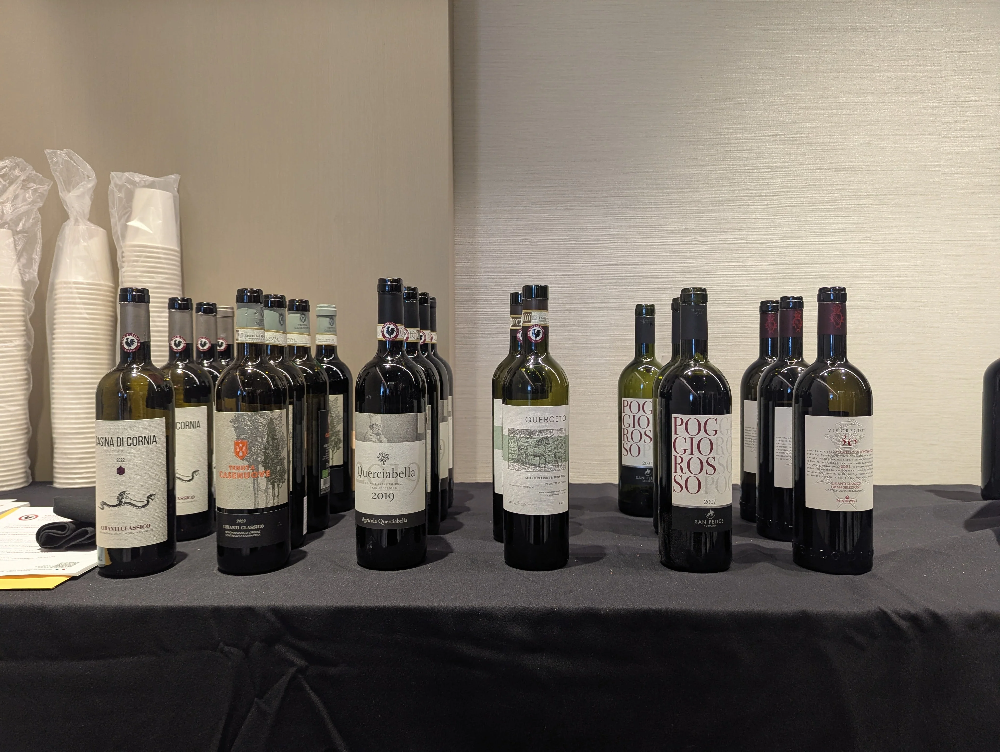

I attended the Chianti Classico tasting event in NY recently, here are some notes from the event:

## Market Momentum

Chianti Classico has recently been one of the few wine appellations to grow **both in dollar value and volume in the U.S. market**.

The presenters claim that the growth is driven by three structural factors:

- A long-term **commitment to quality improvement**
- A sharper focus on **terroir expression** (“territory to bottle”)
- The rollout of the **UGA (Unità Geografiche Aggiuntive)** system [^1]

[^1]: This is a relatively new system of classifying even smaller areas by environmental, climatic, and geological characteristics

## A Philosophy: Tradition as Evolution

Chianti Classico’s leadership does not treat tradition as fixed.

Instead, the region positions itself at the **forefront of Italian appellation evolution**, balancing:

- Historical identity  
- Regulatory reform  
- Modern winemaking  

## Regulatory Evolution (1980s → Today)

The modern style of Chianti Classico is the result of decades of deliberate change:

- **1980s** → Improved *clonal selection*  
- **1990s** → 100% Sangiovese permitted  
- **2000s** → White grapes banned
- **2014** → Introduction of UGA classifications  
- **2023** → Minimum 90% Sangiovese required for DOCG  

What this achieved:

- Greater **purity of expression**
- Stronger alignment between **rules and quality goals**
- More **freedom within a disciplined framework**

## Viticulture: Clones vs. Massal Selection

The presenters framed grape biotypes as nature experimenting, vs clones as humans choosing a winner. 

Increasingly, producers are blending both approaches.

Key considerations:

- Heavy reliance on a single clone increases **disease risk**
- Massal selection improves **resilience and complexity**

## Climate Change as a Tailwind

Climate change is materially affecting Sangiovese:

- Earlier ripening
- Greater phenolic maturity

This has led to:

- Naturally **rounder textures**
- Less aggressive tannins
- Reduced need for heavy intervention in the cellar

## Winemaking: Tannin Management & Precision

Cryomaceration is seeing more adoption

- Adoption: Estimated at ~20 to <50% of producers  
- Process: cold soak immediately (or shortly) after harvest  

Objectives:

- Softer tannin structure  
- Enhanced aromatics  
- Improved color extraction  

## Cross-Regional Influence

Producers are increasingly borrowing ideas from Piedmont (Nebbiolo):

- Managing high-tannin varieties for **earlier accessibility**
- Maintaining structure while improving **drinkability**

## Style Shift

Multiple forces are converging:

- Climate → riper fruit  
- Viticulture → better plant material  
- Regulation → clearer framework  
- Winemaking → improved tannin control  

As a result, modern Chianti Classico wines are:

- More **approachable in youth**
- Still capable of **aging**
- Increasingly **site-expressive**

Importantly, some producers are **intentionally targeting earlier drinkability**, marking a clear shift from the historically austere style.

